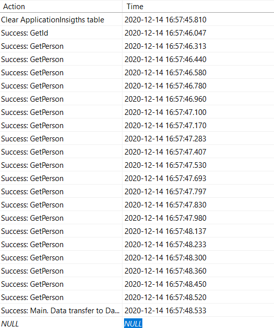
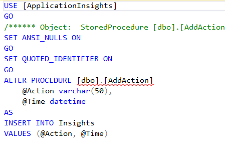
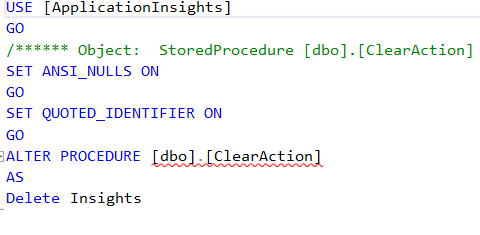
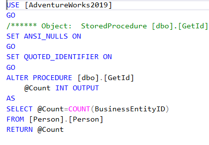
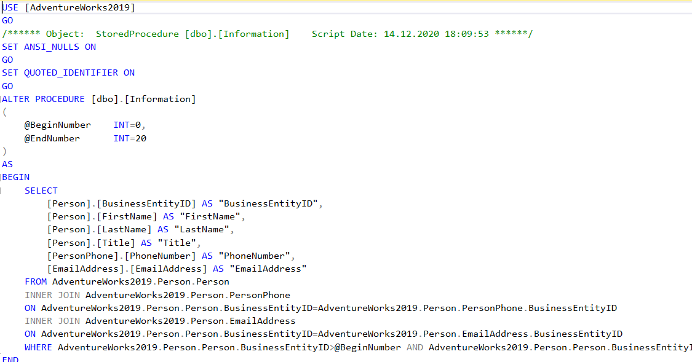

# SharpLaba4
Данная лабараторная работа представляет собой DataManager. 

Программа начинается в классе Program. В первую очередь программа обращается к файлам xml и json и достает информацию:строки подключения к базам данных ApplicationInsights и AdventureWorks2019, а также путь к SourceDirectory и TargetDirectory.

Далее создаётся объект класса DBApplicationInsights, который отвечает за логирование, помимо этого соббщения об ошибках добавляются в файл errorFile. Все действия заносятся в базу данных благодаря методу AddAction. Таблица выглядит следующим образом:

Хранимые процедуры AddAction, ClearAction:

Далее все действия предаставляются DataManager. Он отвечает за подключение к базе AdventureWorks2019 с помощью класса BDAdventure, извлечению данных и формираванию xml-документа. Медот GetId  возвращает количество записей в базе, а метод GetPerson  сами записи. Так как выборка данных возращает большое количество объектов, данные записываются по 1000 элементов в каждый xml-файл. 

Хранимые процедуры:

Файлы хранятся в специальной папке Person. Далее они пересылаются в папку SourceTarget, где всю работу на себя берет  FileWatcher  сервис, разработанный в прошлой лабараторной работе.

